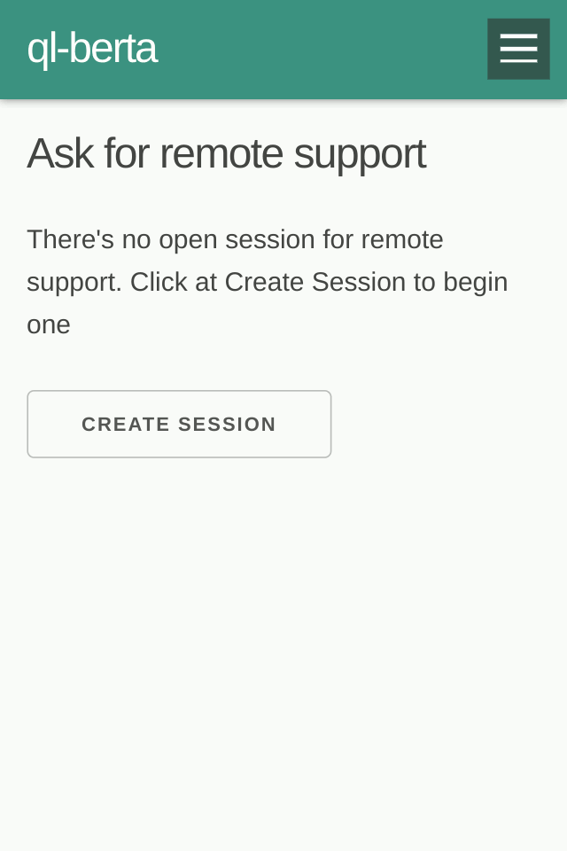

# LiMeApp
[](https://travis-ci.org/libremesh/lime-app) [](http://commitizen.github.io/cz-cli/)


**Geek-free Web App for setup and mantainance of Libremesh nodes built on Preact**


<p align="center"><br><br>
    
</p>


## Development Environment Installation

**Clone this repo:**

```
git clone https://github.com/libremesh/lime-app.git limeapp
cd limeapp
```

**Install the dependencies:**

```
npm install
```


## Development Workflow

### Start a live-reload development server
```
npm run dev
```
 
This will serve the LiMe App with hot reloading. By default it will proxy every backend request to http://10.13.0.1, the default ip address for LibreMesh nodes.

If you already have a LibreMesh router reachable at any given IP address, let's say 10.5.0.9, you can use it as a backend with:

```
env NODE_HOST=10.5.0.9 npm run dev
```

If you want, you can also setup a virtual LibreMesh node following [lime-packages: TESTING.md](https://github.com/libremesh/lime-packages/blob/master/TESTING.md#development-with-qemu-virtual-machine), which will be available at http://10.13.0.1 by default.

### Generate a production build
```
npm run build:production
```
Now you can copy the bundles to the router:

```
ssh root@10.13.0.1 "rm -rf /www/app/*" && scp -r ./build/* root@10.13.0.1:/www/app
```

### Run tests
```
npm run tests
```

### Contribute
Plase, read the ["How to contribute and code of conduct"](CONTRIBUTING.md) documentation.
We also have a [Tutorial](docs/Tutorial.md) for newcomers :)
