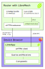

# LimeApp's Developer Tutorial
Wellcome, this the developer tutorial for LimeApp developers!

## What do I need to know to collaborate in the LimeApp?

The LimeApp is written in Javascript, HTML and css.
Having a basic knowledge of these languages will help you to collaborate in the  in the development. You can follow these resources to learn about these languages:
- Javascript tutorial: https://javascript.info/
	- We particularly recommend you to read about [Promises](https://es.javascript.info/promise-basics)
 
You can also learn by doing, following this guide and encouraging you to try making changes or adding new screens.

## Architectural Design
<figure>
	
	<figcaption>Architectural Design of the LimeApp</figcaption>
</figure>

The LimeApp is a web application built on top of the [Preact framework](https://preactjs.com/) which is very similar to React, yet we chose it because it takes less space (3kB).
The application bundle, which includes all the application code executable by a web browser, is hosted in `/www/app` and is served by the uHTTPd webserver when visiting the IP address of the router or the domain associated with it, typically: thisnode.info.

uHTTPd has a plugin for [ubus](https://openwrt.org/docs/techref/ubus) that allows us to make ubus calls to the different libremesh services/modules through HTTP POST requests using the JSON RPC (Remote Procedure Call) message protocol.
This is the interface used in the LimeApp to make calls to the `backend` (the router).

It does not matter if you are not familiar with these technologies right now, you will discover them through practice.

## The elements of the LimeApp
A typical LimeApp functionality implements a screen composed of one or more Preact `Components`.
The `Components` define what is rendered on screen, specifying the visual aspect of the screen (HTML + css) and the logical one: what is displayed, when, and which action each button performs.
In the LimeApp screens we commonly want to display information that is available on the router, (e.g. how long ago it was turned on), and perform actions that modify the router configuration (e.g. change the administration password). This is what we mean by `backend` calls.
To connect the interface with `backend` calls the `Components` use `Queries` and `Mutations` from the [React Query](react-query.tanstack.com/) library.
This library allows us to declaratively indicate what data (`Queries`) each component uses and what actions (`Mutations`) each component performs. And it also relieves us from the complexity of: re-rendering each screen component that depends on a data that was updated in the `backend`, de-duplicating repeated calls, and managing the cache of these calls to avoid asking twice for the same data unnecessarily.

The `Queries` and `Mutations` call asynchronous functions that define the url endpoints and the body of the requests to the backend. We call these functions API endpoints. They match one by one with the `backend` endpoints.
All of them use a common interface, the `uHTTPd client`, a singleton that abstracts us from handling the ubus session id, the base url address of the webserver and the details of the JSON RPC protocol.

## Example

To better understand how all these pieces interact with each other, let's see an example:
Remote Access. Remote Access allows you to open a terminal session on the router to be accessed remotely by another person to help diagnose problems on the network. In the LimeApp we implemented this functionality based on [tmate](tmate.io). The screen allows you to view the current session token, close the current session or open a new session.
Let's start the tour!

### Tests

The LimeApp has a growing test battery. This battery provides a testing setup and sample tests that allow us to develop new functionality using [Test Driven Development](https://en.wikipedia.org/wiki/Test-driven_development).

To implement the tests we use the Testing Framework [Jest](https://jestjs.io/) together with the  [Testing Library](https://testing-library.com/).
This library allows us to write tests that verify the performance of our components from the user's perspective, and are resistant to implementation changes.

The testing strategy is as follows:
We test two things separately:
- 1) the component that renders the functionality we are testing, by mocking the API endpoints that call the `backend`.
- 2) the API endpoints that call the `backend`.
This way, if the tests for the API endpoints pass, the endpoint mocks in the component tests match the tested implementation and the component tests also pass, we are guaranteed that the component works as expected, from the interface to the backend calls.

The reason for doing this two-step split is that it fits very well with Jest's mocking capabilities.

#### Component Tests
The main tip for writing component tests is to think about the requirements it has to fulfill from the user's perspective. They are usually of the type:
"If I click button A, it shows me text B".
"If I submit form B, and the backend reports an error, it shows me the error."
We also test that the endpoints are called with the correct parameters.

In order to mock the API endpoints, we first have to define them. We can postpone the actual implementation for later.

```javascript
// File at: lime-plugin-remotesupport/src/remoteSupportApi.js

export function getSession() {}
export function openSession() {}
export function closeSession() {}
```

These are the functions that our `Queries` and `Mutations` will use later, for the moment they don't do anything, they only allow us to mock them.

Now we are ready to define the tests of the component. Each part is explained in the comments.

```javascript
// File at: lime-plugin-remotesupport/remoteSupport.spec.js

// Import Preact pragma, needed to render components using jsx.
import { h } from 'preact';
// Import utils from the Testing Library
import { fireEvent, cleanup, act, screen } from '@testing-library/preact';
import '@testing-library/jest-dom';

// Import the test utility "render" which helps us to render the component in the same context as it will be rendered in the final application.
import { render } from 'utils/test_utils';

// Import the main component for the remote support screen, which we didn't implement yet.
import RemoteSupportPage from './src/remoteSupportPage';

// Import and mock the API endpoints that we defined above.
import { getSession, openSession, closeSession } from './src/remoteSupportApi';
jest.mock('./src/remoteSupportApi');

describe('Remote Support Page', () => {
	// Before each test we mock API endpoints with the default mock implementation.
	beforeEach(() => {
		getSession.mockImplementation(async () =>
			({ rw_ssh: 'ssh -p2222 test_rw_token@test_host', ro_ssh: 'ssh -p2222 test_ro_token@test_host'})
		);
		openSession.mockImplementation(async () => null);
		closeSession.mockImplementation(async () => null);
	});

	// After each test we cleanup the testing environment.
	afterEach(() => {
		cleanup();
		act(() => queryCache.clear());
	});
	
	// We test that the expected elements are rendered in each scenario.

	it('shows a button to create session when there is no session', async () => {
		getSession.mockImplementation(async () => null);
		render(<RemoteSupportPage />);
		expect(await screen.findByRole('button', {name: /create session/i })).toBeEnabled();
	});

	it('shows rw session token when there is an open session', async () => {
		render(<RemoteSupportPage />);
		expect(await screen.findByText('ssh -p2222 test_rw_token@test_host')).toBeInTheDocument();
	})

	it('shows a button to close session when there is an open session', async () => {
		render(<RemoteSupportPage />);
		expect(await screen.findByRole('button', {name: /close session/i})).toBeEnabled();
	})

	it('show an error when open session fails', async() => {
		getSession.mockImplementation(async() => null);
		openSession.mockImplementation(async() => { throw new Error() })
		render(<RemoteSupportPage />)
		fireEvent.click(
			await screen.findByRole('button', {name: /create session/i })
		);
		expect(await screen.findByText(/Cannot connect to the remote support server/i)).toBeVisible();
	});
});
```

Once we have the component tests we can get into the component implementation itself (`RemoteSupportPage`).

> Tip: Using `it.skip(...)` we can mark the tests so that they are not executed, and gradually unmark from the simplest to the most complex, as we advance in the implementation.


To run the tests we do:
```
npm run test plugins/lime-plugin-remotesupport/remoteSupport.spec.js
```

#### API endpoints tests
After having created the tests of the component, surely we already have more confidence in what data and what actions each one of the API endpoints should perform. We can discuss the API with whoever developed the `backend` and settle it down on the tests.

```javascript
// File Path: lime-plugin-remotesupport/src/remoteSupportApi.spec.js

// Import and mock the uHTTPd client
import api from 'utils/uhttpd.service';
jest.mock('utils/uhttpd.service')

// Import the API endpoints to be tested
import { getSession, openSession, closeSession } from './remoteSupportApi';

// Before each test we reset the uHTTPd client mock implementation.
beforeEach(() => {
    api.call.mockClear();
    api.call.mockImplementation(async () => ({ status: 'ok' }));
})

describe('getSession', () => {
    it('calls the expected endpoint', async () => {
        await getSession();
        expect(api.call).toBeCalledWith('tmate', 'get_session', {});
    })

    it('resolves to session when there is a connected session', async () => {
        const sessionData = {
            rw_ssh: 'ssh -p2222 pL2qpxKQvPP9f9GPWjG2WkfrM@ny1.tmate.io',
            ro_ssh: 'ssh -p2222 pL2qpxKQvPP9f9GPWjG2WkfrM@ny1.tmate.io'
        };
        api.call.mockImplementation(async () => (
            {
                status: 'ok',
                session: sessionData,
            }));
        let session = await getSession();
        expect(session).toEqual(sessionData);
    });

    it('resolves to null when there is a non established session', async () => {
        const sessionData = {
            rw_ssh: "", ro_ssh: ""
        };
        api.call.mockImplementation(async () => (
            {
                status: 'ok',
                session: sessionData,
            }));
        let session = await getSession();
        expect(session).toBeNull();
    });
});

describe('closeSession', () => {
    it('calls the expected endpoint', async () => {
        await closeSession();
        expect(api.call).toBeCalledWith('tmate', 'close_session', {})
    })
});

describe('openSession', () => {
    it('calls the expected endpoint', async () => {
        await openSession();
        expect(api.call).toBeCalledWith('tmate', 'open_session', {})
    })

    it('resolves to api response on success', async () => {
        const result = await openSession();
        expect(result).toEqual({ status: 'ok'})
    })

    it('rejects to api call error on error', async () => {
        api.call.mockImplementationOnce(() => Promise.reject('timeout'));
        api.call.mockImplementationOnce(async () => ({'status': 'ok'}));
        expect.assertions(1);
        try {
            await openSession()
        } catch (e) {
            expect(e).toEqual('timeout')
        }
    })

    it('calls close session when rejected ', async () => {
        api.call.mockImplementationOnce(() => Promise.reject('timeout'));
        api.call.mockImplementationOnce(async () => ({'status': 'ok'}));
        expect.assertions(1);
        try {
            await openSession()
        } catch (e) {
            expect(api.call).toBeCalledWith('tmate', 'close_session', {})
        }
    })
});

```

Once we have written the tests for our API endpoints we can implement them.

### Queries and Mutations

The Queries and Mutations will connect our component with the API endpoints.
They relieve us from the complexity of re-rendering each component on the screen that depends on data that was updated in the `backend`. That is, if there is more than one component on the screen that depends on the same `Query` and one of the two performs an action that updates the `backend` data, both components will be re-rendered to show the updated information.
They also allow us to de-duplicate repeated calls, and manage the cache of these calls, so we can use the same `Query` in many components without that meaning multiple and unnecessary repeated requests to the `backend`. All that is articulated in a global instance of the `QueryCache`.
The `Queries` and `Mutations` are (Hooks)[https://preactjs.com/guide/v10/hooks/] of Preact.

Without further delay, let's implement them, each part is explained in the comments.

```javascript
// Path: lime-plugin-remotesupport/src/remoteSupportQueries.js

// Import react-query hooks
import { useQuery, useMutation } from 'react-query';
// Import the singleton instance of QueryCache.
import queryCache from 'utils/queryCache';
import { getSession, openSession, closeSession } from './remoteSupportApi'

export function useSession() {
	// Each Query has a unique identifier in the QueryCache. In this case: ["tmate", "get_session"]
	// The second parameter is an asynchronous function, the API endpoint.
	return useQuery(["tmate", "get_session"], getSession);
}

export function useOpenSession() {
	return useMutation(openSession, {
		// After successfully opening a new session, we invalidate the useSession query.
		// This will force all rendered components using the session information to be re-rendered to show up the new session data.
		onSuccess: () => queryCache.invalidateQueries(["tmate", "get_session"]),
		// We can also set specific data for a query in the queryCache. 
		// In this case, in which openSession failed, we specify null as the new session data.
		onError: () => queryCache.setQueryData(["tmate", "get_session"], null)
	})
}

export function useCloseSession() {
	return useMutation(closeSession, {
		onSuccess: () => queryCache.invalidateQueries(["tmate", "get_session"])
	})
}
```

Now that we have our `Queries` and `Mutations` written, we can use them in the `Component`.

### Component

The main `Component` has to render the Remote Access screen. It has to comply with the tests that we defined in section "4.1.2 Component Tests".
A strategy that works well in practice is to iterate the implementation so that it satisfies the simplest tests first, and then the more complex ones. That way we keep the room for introducing bugs tight, and debugging becomes easier.
To define what is rendered, we use [JSX](https://reactjs.org/docs/introducing-jsx.html), an extension to JavaScript which allows us to define the structure of the document in a declarative way, and then Babel compiles it to DOM imperative calls of type document.createElement().
Let's see how our component that passes the tests is implemented.

```javascript
// File Path: lime-plugin-remotesupport/src/remoteSupportPage.js
import { h } from 'preact';
import { useSession, useOpenSession, useCloseSession } from './remoteSupportQueries';
import Loading from 'components/loading';
// We use i18n-js for internazionalization
import I18n from 'i18n-js';

const RemoteSupportPage = () => {
	// React Query make it easy to see the status of a query (i.e, isLoading).
	const {data: session, isLoading: loadingSession} = useSession();
	const [openSession, openStatus] = useOpenSession();
	const [closeSession, closeStatus] = useCloseSession();

	if (loadingSession) {
		return <div class="container container-center"><Loading /></div>
	}

	return(
		<div>
			<h4>{I18n.t("Ask for remote support")}</h4>
			{!session &&
				<div>
					<p>{I18n.t("There's no open session for remote support. Click at Create Session to begin one")}</p>
					<button onClick={openSession}>{I18n.t("Create Session")}</button>
				</div>
			}
			{openStatus.isError &&
				<div>
					<b>{I18n.t("Cannot connect to the remote support server")}</b><br />
					{I18n.t("Please verify your internet connection")}
				</div>
			}
			{session &&
				<div>
					<p>{I18n.t("There's an active remote support session")}</p>
					<p>{I18n.t("Share the following command with whoever you want to give them access to your node")}</p>
					<div><pre>{session.rw_ssh}</pre></div>
					<div>
						<h5>{I18n.t("Close Session")}</h5>
						<p>{I18n.t("Click at Close Session to end the remote support session. No one will be able to access your node with this token again")}</p>
						<button onClick={closeSession}>{I18n.t("Close Session")}</button>
					</div>
				</div>
			}
			{openStatus.isLoading || closeStatus.isLoading &&
				<Loading />
			}
		</div>
	);

	export default RemoteSupportPage;
```

#### Style and Visualization

##### Storybook

Once our component passes the tests, we can add styling with css classes to achieve the UI we are looking for.

In order to visualize our component while we add style to it we use [StoryBook](https://storybook.js.org/). Storybook allows you to define the different states of your screen as different user `Stories` and render your component isolated in that context. This is very helpfull as it speeds up the visual feedback while developing components. Also, once the stories are written, it is easy to go back to them to monitor changes in the UI.
This is how it looks like:  


Let's define the stories for our component.

```javascript
// File path: plugins/lime-plugin-remotesupport/remotesupport.stories.js
import { RemoteSupportPage } from './src/remoteSupportPage';

// In the default export we define a title for this group of stories.
export default {
	title: 'Containers/RemoteSupport'
};

// each additional export is a Story that represents a different scenario

export const noSession = () => <RemoteSupportPage/>;
noSession.args = {
	queries: [
		[['tmate', 'get_session'], null]
	]
};

export const openedSession = () => <RemoteSupportPage />;
openedSession.args = {
	queries: [
		[['tmate', 'get_session'], {
			rw_ssh: 'ssh -p2222 pL2qpxKQvPP9f9GPWjG2WkfrM@remotesupportlibrerouter.org',
			}
		]
	]
};
```

In the example above we use a QueryCache mock, to give context to our stories. The details of this setup are in the StoryBook configuration.
An alternative is to separate the implementation of our component in a HOC (High Order Component) and a presentational component, then the HOC passes properties to the presentational component with all the necessary information to do the rendering. This would allow us to visually test more cases, since there is no internal state in the presentational component.

Both approaches have their pros and cons. It depends on each case which one is more comfortable.

Once we define the stories, we can run Storybook with:

```
npm run storybook
```

##### CSS

To add styling rules that only apply to one component, we can use css/less loaders in the following way: 

```javascript
// File Path: lime-plugin-remotesupport/src/remoteSupportPage.js
// (...)
import style from './style.less'
// (...)
return (
	//(...)
	<div class={style.someClass} />
	// (...)
)
```

```less
// File Path: lime-plugin-remotesupport/src/style.less
.someClass {
	backgroundColor: #f2f2f2f2;
}
```

For more general styling rules, which could be used everywhere in the app, we use a global index.less style sheet, following class names from bootstrap.
Example:

```less
// File Path: index.less

.d-flex {
	display: flex;
}

```

```javascript
// File Path: lime-plugin-remotesupport/src/remoteSupportPage.js
// (...)
return (
	//(...)
	<div class="d-flex" />
	// (...)
)
```

### API endpoints

The only missing piece is the API endpoints implementation, which should comply to the tests defined at "4.1.3 - API endpoints tests".

```javascript
import api from 'utils/uhttpd.service';

export function getSession() {
	return api.call("tmate", "get_session", {})
		.then(result => result.session || null);
}

export function openSession() {
	return api.call("tmate", "open_session", {})
		.catch((error) => {
			closeSession();
			throw error;
		})
}

export function closeSession() {
	return api.call("tmate", "close_session", {})
}
```

### Adding a menu item.

To add a link to our new screen in the mesnu, we have to define an index.js file for remoteSupport like this: 

```javascript
// Path: lime-plugin-remotesupport/index.js
import { h } from 'preact';
import I18n from 'i18n-js';
import RemoteSupportPage from './src/remoteSupportPage';

export default {
	name: 'remotesupport',
	page: RemoteSupportPage,
	// menu defines the element to be rendered in the menu list.
	menu: () => <a href={'#/remotesupport'}>{I18n.t('Remote Support')}</a>,
}
```

And then we added it to the plugins list.

```javascript
// (...)
import RemoteSupport from '../plugins/lime-plugin-remotesupport';

export const plugins = [
	// (...)
	// The order in which menu options are shown is the same as in this list.
	RemoteSupport,
];
```

### Conclusion
Finally, we have completed all the steps needed for adding a new screen to the LimeApp, which is fully tested, functional and styled.

## Translations
Follow instructions at [CONTRIBUTING.md](CONTRIBUTING.md#contributing-with-translations)

## Devtools
### Script "create-plugin"
This dev tool helps to bootstrap a directory structure for a new plugin.
You only need to chose a name for it,
and a working basic skeleton will be created under lime-plugin-<newPluginName>.

Try it with:
```
npm run create-plugin <newPluginName (camelCased)>
```

## Advanced topics
### Legacy code

Before using the ReactQuery library, the LimeApp code used Redux + Rx-Js to store and update the `backend` state. The files including the concepts of  "epics", "actions", "reducers"  are legacy code that still have to be migrated to use ReactQuery.
The reason we abandoned those libraries is that they added more indirection to the code than the benefit we were getting from them. ReactQuery has a more straightforward API, which makes it easier to follow the code. We will gradually migrate the legacy code to ReactQuery.

### Urls routing
TODO
### Password protected routes
TODO
### package-lock.json
TODO

### Further recommended reading
- [React as a UI Runtime](https://overreacted.io/react-as-a-ui-runtime/) by Dan Abramov. Usefull to get a deep understanding of the React programming model.
